<h1>Jogo da Memoria</h1>

Um jogo da memória 4x4 de dois jogadores feito no Logisim com circuitos lógicos.

Trabalho de Circuitos Digitais - Ciência da Computação - Universidade Federal do Cariri

Alunos:  
João Gabriel de Alencar Fonseca  
Fabricio Elizio Lima dos Santos

Professor:  
Ramon Santos Nepomuceno

<h2>O Projeto</h2>

Este projeto consiste na criação de um jogo da memória utilizando o Logisim. O jogo apresenta um tabuleiro com design 4x4, contendo 8 pares de números (de 1 a 8) que devem ser encontrados pelos jogadores. O controle do jogo é feito por meio de botões direcionais para selecionar as casas, além de um botão de confirmação e outro de reset, que permite reiniciar a partida. O circuito também inclui um placar que exibe a pontuação dos jogadores, indicando vitórias do jogador A, do jogador B ou um possível empate. Confira o game:

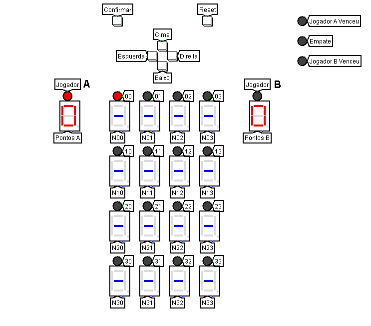

<h3>Como Jogar</h3>

O jogador, em sua vez(indicada pelo LED acima da pontuação), deve selecionar duas casas utilizando os controles direcionais e o botão de confirmação. Após escolher as duas casas e confirmar novamente, o jogo verificará se ambas contêm o mesmo número. Caso isso ocorra, o jogador ganha um ponto e a vez passa para o próximo jogador. O jogo termina quando todas as combinações forem encontradas, e vence o jogador com a maior pontuação. Se ambos obtiverem 4 pontos, o jogo terminará em empate.

<h2>O Circuito</h2>

<h3>Displays</h3>

Foram utilizados displays hexadecimais para representar as casas do jogo. Quando uma casa está escondida, o display exibe um traço, e quando revelada, mostra um número de 1 a 8 correspondente ao valor oculto. Cada display conta com um LED indicador acima dele que sinaliza ao jogador qual casa está atualmente selecionada(O LED ligado é representado pela cor vermelha)

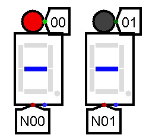

<h3>Controles de Seleção</h3>

A posição das casas selecionadas no jogo é controlada por meio de quatro botões, cada um correspondente a uma direção específica: cima, baixo, esquerda e direita. Esses botões permitem que o jogador navegue pelo tabuleiro e escolha as casas desejadas de forma intuitiva.

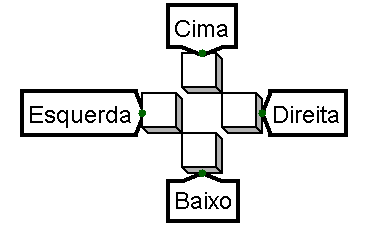

A posição atual no tabuleiro é armazenada em dois contadores de 2 bits: um para o eixo vertical (saída X) e outro para o eixo horizontal (saída Y). Os botões de controle estão conectados ao clock de cada contador por meio de uma porta OR, o que permite incrementar o valor armazenado a cada pulso. No entanto, ao utilizar a entrada "Load", que está conectada a um dos botões, é possível decrementar o valor, permitindo a mudança na direção do movimento.

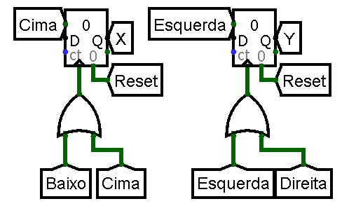

Com as posições armazenadas nos contadores, é possível gerar 16 combinações únicas entre as saídas X e Y, cada uma correspondente a uma posição no tabuleiro. Isso é realizado por meio de um decodificador, onde as saídas X e Y são combinadas e enviadas às entradas de seleção do decodificador através de distribuidores. Cada saída do decodificador está conectada a um LED de seleção, que indica a posição ativa no tabuleiro. Assim, ao pressionar os botões direcionais, as posições nos contadores são atualizadas, e o LED correspondente à nova posição é aceso pelo decodificador.

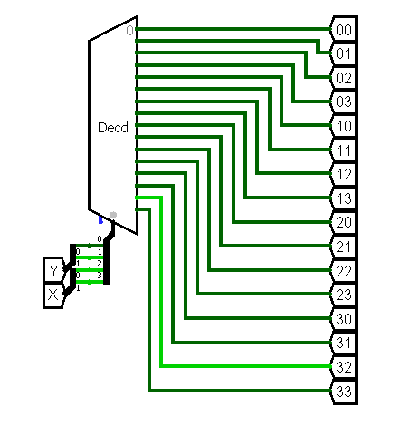

<h3>Game Loop e a Maquina de Estados Finitos</h3>

O Game Loop é o componente responsável por garantir a execução ordenada das ações no jogo. Ele funciona como uma máquina de estados, utilizando um contador de 2 bits limitado de 0 a 2, o que resulta em três estados possíveis. Cada estado representa uma fase distinta do jogo, assegurando que as etapas sejam realizadas na sequência correta.

Estado 0: É o estado inicial de cada turno, onde o jogador pode selecionar e confirmar o primeiro número.

Estado 1: O jogador pode selecionar e confirmar o segundo número. Após isso, compara ambos e acrescenta um ponto ao jogador caso sejam iguais.

Estado 2: Reseta variáveis temporárias e troca o turno do jogador. Após isso retorna ao estado 0.

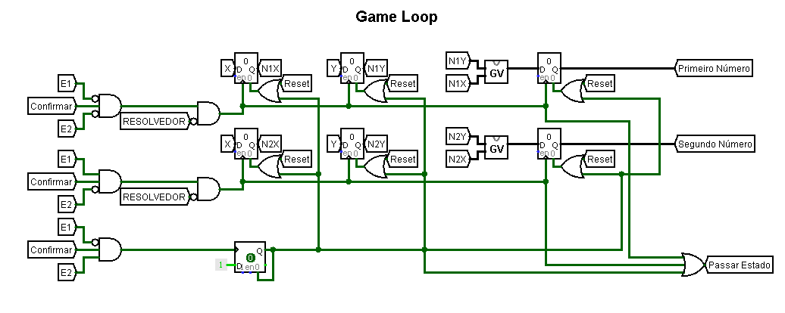

Cada estado do Game Loop é acionado por uma porta AND tripla, que aguarda o pulso do botão de confirmação e os bits correspondentes ao estado atual. Para facilitar a comparação, os bits do contador responsável pelos estados foram divididos em dois "túneis", E1 e E2.

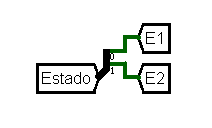

Após a porta AND inicial ser acionada, o circuito encontra outra porta AND que exige o resultado de um túnel chamado "Validador". Este túnel é responsável por verificar se as casas selecionadas possuem a mesma posição e se já foram acertadas. O funcionamento detalhado deste circuito será explicado posteriormente.

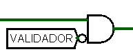

A execução dos estados 0 e 1 do Game Loop é semelhante. Em ambos os estados, o circuito conta com três registradores. Dois desses registradores armazenam as coordenadas X e Y da posição selecionada, enquanto o terceiro registra o número revelado na posição correspondente. Os registradores de posição são configurados para atualizar na borda de subida do clock, enquanto o registrador que guarda o número oculto é atualizado na borda de descida. Isso permite que as coordenadas sejam preparadas corretamente antes de serem utilizadas para identificar o número correspondente àquela posição.

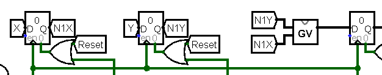

Os registradores responsáveis por armazenar o número revelado de cada posição obtêm esse valor através de um circuito denominado "GV" (Grid to Value). Esse circuito recebe como entrada os valores dos registradores que armazenam as coordenadas X e Y da posição selecionada, permitindo que o número correspondente a essa posição seja recuperado e armazenado no registrador de valor.

O circuito GV (Grid to Value) é, na verdade, um multiplexador que recebe 16 constantes predefinidas, provenientes de outro circuito denominado Secret. Essas constantes representam os números ocultos nas casas do jogo. O multiplexador utiliza as coordenadas X e Y, fornecidas como entradas, para selecionar a constante correspondente à posição no tabuleiro. As coordenadas são combinadas por distribuidores, de maneira semelhante ao processo utilizado para o seletor de LEDs. A saída do multiplexador, então, fornece o número oculto naquela posição específica.

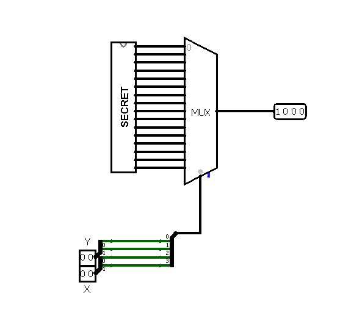

O estado 2 utiliza um Flip-Flop do tipo D para gerar um pulso na borda de descida, o que evita bugs que poderiam impedir a redução do ciclo de 4 para 3 estados totais. Nesse pulso, os registradores dos estados 0 e 1 são resetados, retornando ao estado 0 e finalizando o loop.

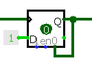

<h3>Acertos e Revelação de Casas</h3>

A lógica para o acerto e revelação das casas no jogo envolve o uso de um multiplexador para cada casa. A entrada do multiplexador vem do circuito Secret, enquanto sua seleção é controlada por uma porta OR que recebe três possibilidades:

1 - Casa está sendo revelada pela seleção do primeiro número.

2 - Casa está sendo revelada pela seleção do segundo número.

3 - A casa já foi acertada.

Essas três possibilidades ativam o multiplexador, cuja saída é conectada ao display hexadecimal correspondente, permitindo que a casa seja corretamente revelada.

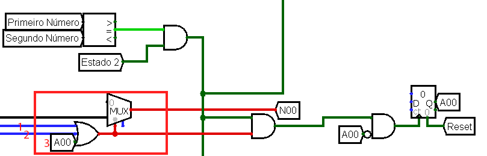

Para que um número seja considerado acertado, é utilizado um comparador que verifica a correspondência entre o número armazenado no registrador do primeiro número e o número armazenado no registrador do segundo número no Game Loop, após isso, passa por uma porta AND junto à um túnel que representa o estado 2, dessa forma a comparação só acontece após os dois números serem definidos nos registradores, evitando a comparação de zero com zero.

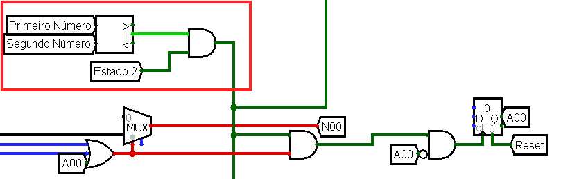

Quando a casa está revelada e os números nos registradores do primeiro e do segundo número são iguais, uma porta AND é ativada. Isso, por sua vez, aciona um contador de 1bit, que depende do próprio valor de sáida para ser incrementado, garantindo que o contador mantenha o valor 1 até o final do jogo. Alternativamente, isso poderia ser feito utilizando a configuração de transbordamento do contador no Logisim, para que o contador permaneça no mesmo valor ao chegar no final.

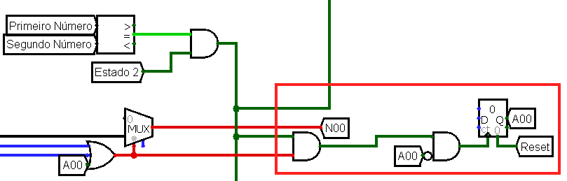

O padrão de mux e contador se repete 16 vezes, uma para cada casa no tabuleiro.

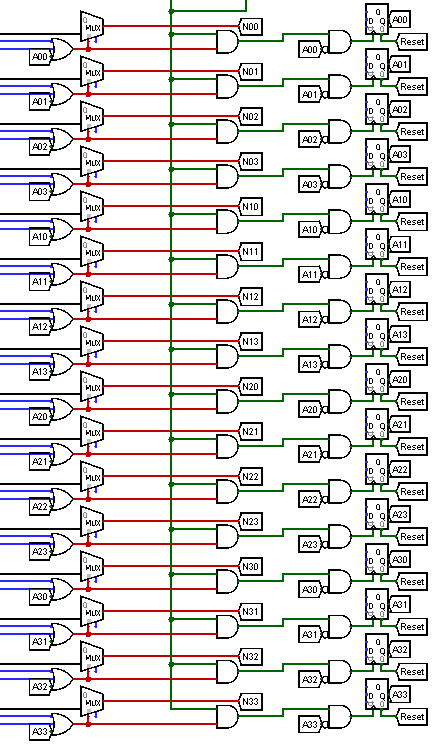

<h3>Pontuação e troca de jogador</h3>

A pontuação 

