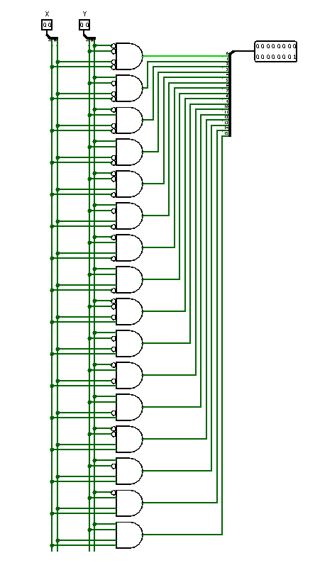

<h1>Jogo da Memoria</h1>

Um jogo da memória 4x4 de dois jogadores feito no Logisim com circuitos lógicos.

Trabalho de Circuitos Digitais - Ciência da Computação - Universidade Federal do Cariri

Alunos:  
João Gabriel de Alencar Fonseca  
Fabricio Elizio Lima dos Santos

Professor:  
Ramon Santos Nepomuceno

<h2>O Projeto</h2>

Este projeto consiste na criação de um jogo da memória utilizando o Logisim. O jogo apresenta um tabuleiro com design 4x4, contendo 8 pares de números (de 1 a 8) que devem ser encontrados pelos jogadores. O controle do jogo é feito por meio de botões direcionais para selecionar as casas, além de um botão de confirmação e outro de reset, que permite reiniciar a partida. O circuito também inclui um placar que exibe a pontuação dos jogadores, indicando vitórias do jogador A, do jogador B ou um possível empate. Confira o game:

<h3>Como Jogar</h3>

O jogador, em sua vez(indicada pelo LED acima da pontuação), deve selecionar duas casas utilizando os controles direcionais e o botão de confirmação. Após escolher as duas casas e confirmar novamente, o jogo verificará se ambas contêm o mesmo número. Caso isso ocorra, o jogador ganha um ponto e a vez passa para o próximo jogador. O jogo termina quando todas as combinações forem encontradas, e vence o jogador com a maior pontuação. Se ambos obtiverem 4 pontos, o jogo terminará em empate.

<h2>O Circuito</h2>

<h3>Displays</h3>

Foram utilizados displays hexadecimais para representar as casas do jogo. Quando uma casa está escondida, o display exibe um traço, e quando revelada, mostra um número de 1 a 8 correspondente ao valor oculto. Cada display conta com um LED indicador acima dele que sinaliza ao jogador qual casa está atualmente selecionada(O LED ligado é representado pela cor vermelha)

<h3>Controles de Seleção</h3>

A posição das casas selecionadas no jogo é controlada por meio de quatro botões, cada um correspondente a uma direção específica: cima, baixo, esquerda e direita. Esses botões permitem que o jogador navegue pelo tabuleiro e escolha as casas desejadas de forma intuitiva.

A posição atual no tabuleiro é armazenada em dois contadores de 2 bits: um para o eixo vertical (saída X) e outro para o eixo horizontal (saída Y). Os botões de controle estão conectados ao clock de cada contador por meio de uma porta OR, o que permite incrementar o valor armazenado a cada pulso. No entanto, ao utilizar a entrada "Load", que está conectada a um dos botões, é possível decrementar o valor, permitindo a mudança na direção do movimento.

Com as posições armazenadas nos contadores, é possível gerar 16 combinações únicas entre as saídas X e Y, cada uma correspondente a uma posição no tabuleiro. Isso é realizado por meio de um decodificador, onde as saídas X e Y são combinadas e enviadas às entradas de seleção do decodificador através de distribuidores. Cada saída do decodificador está conectada a um LED de seleção, que indica a posição ativa no tabuleiro. Assim, ao pressionar os botões direcionais, as posições nos contadores são atualizadas, e o LED correspondente à nova posição é aceso pelo decodificador.

